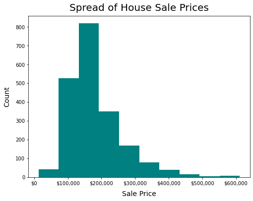
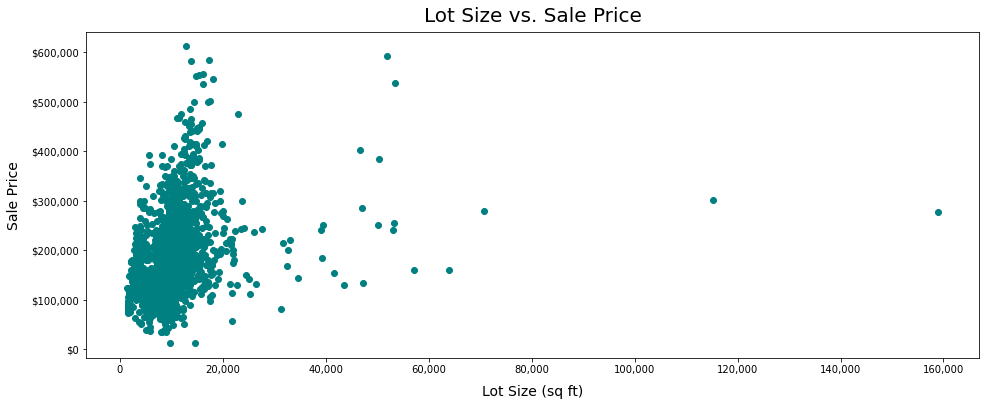
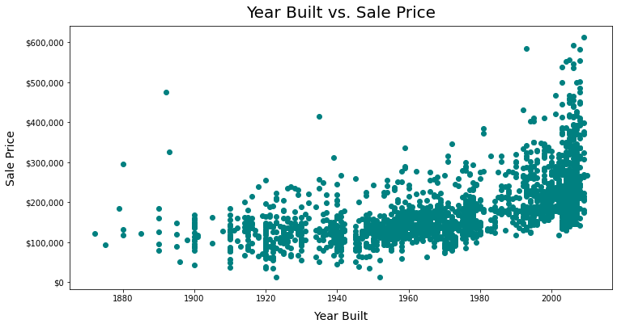
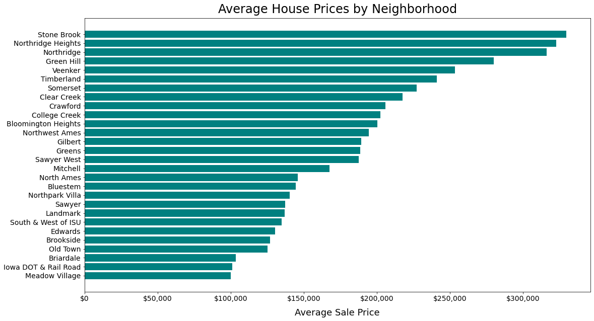
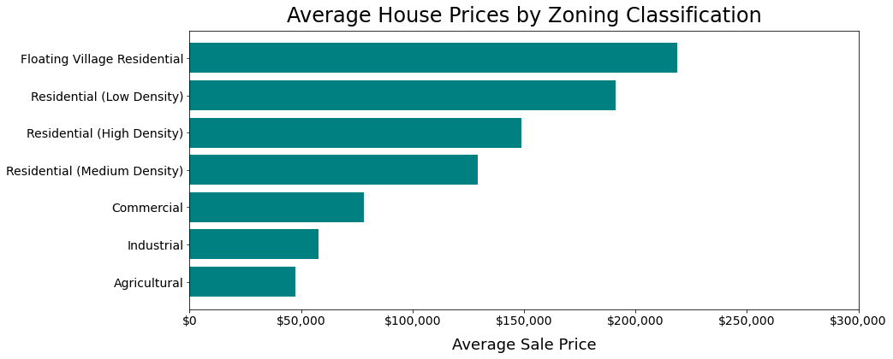
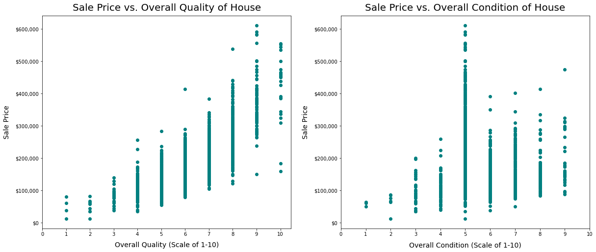

# Project 2 - Elliot Richardson

**Please view my summary presentation [here](https://drive.google.com/file/d/1n-G_89ek2gWwvvz98bx4ner5Gy5lMJj_/view?usp=sharing).**

## Table of Contents:
I. [Problem statement](#Problem-Statement)

II. [Data dictionary](#Data-used)

III. [Methodology](#Methodology)

&nbsp;&nbsp;&nbsp;&nbsp;&nbsp;&nbsp;&nbsp;&nbsp;&nbsp;   a. [Cleaning](#I-Investigating-and-cleaning) 
    
&nbsp;&nbsp;&nbsp;&nbsp;&nbsp;&nbsp;&nbsp;&nbsp;&nbsp;   b. [Exploratory analysis](#II-Exploratory-analysis)
   
&nbsp;&nbsp;&nbsp;&nbsp;&nbsp;&nbsp;&nbsp;&nbsp;&nbsp;   c. [Feature selection](#III-Feature-selection)
   
&nbsp;&nbsp;&nbsp;&nbsp;&nbsp;&nbsp;&nbsp;&nbsp;&nbsp;   d. [Modeling](#VI-Modeling)
   
IV. [Conclusion](#Conclusion)

## Problem Statement: 
For this project, I am a consultant hired by a real estate company to help them predict market prices for houses in the Ames area. Using data they collect in the field, I was hired to construct a model that would return a predicted sale price for each house so they could cross reference their gut assumptions with something more objective.

**Some questions I considered:**

1. How do these features affect house prices? Are their effects consistent?
2. Are there many other signficant factors that aren't captured in this data?
3. Which model will predict prices best?

## Data used:

Test and Train datasets from the [Kaggle challenge](https://www.kaggle.com/c/dsir-202021214-e-project-2-regression-challenge/data). 

## Data dictionary: 

|Feature|Type|Description|
|---|---|---|
|id|int64|Unique Identifier|
|ms_zoning|object|Identifies zoning classification of the sale ([read more here](https://www.kaggle.com/c/dsir-202021214-e-project-2-regression-challenge/data))|
|lot_frontage|float64|Linear feet of street connected to property|
|lot_area|int64|Lot size in square feet|
|alley|object|Type of alley access to property|
|lot_shape|int64|General shape of property|
|land_contour|object|Flatness of the property|
|lot_config|object|The type of location of the house relative to the block it's on ([read more here](https://www.kaggle.com/c/dsir-202021214-e-project-2-regression-challenge/data))|
|land_slope|int64|Slope of property|
|neighborhood|object|Physical locations within Ames city limits|
|bldg_type|object|Type of dwelling ([read more here](https://www.kaggle.com/c/dsir-202021214-e-project-2-regression-challenge/data))|
|house_style|float64|Style of dwelling ([read more here](https://www.kaggle.com/c/dsir-202021214-e-project-2-regression-challenge/data))|
|overall_qual|int64|Overall material and finish quality rating (1-10)|
|overall_cond|int64|Overall condition rating (1-10)|
|year_built|int64|Original construction year|
|year_remod/add|int64|Year of remodeling if any|
|roof_style|object|Type of roof|
|roof_matl|object|Roof material|
|exterior_1st|object|Exterior covering on house|
|exterior_2nd|object|Exterior covering on house (if more than one material)|
|mas_vnr_type|object|Masonry veneer type|
|mas_vnr_area|float64|Masonry veneer area|
|exter_qual|int64|Exterior material quality|
|exter_cond|int64|Present condition of the material on the exterior|
|foundation|object|Type of foundation|
|bsmt_qual|float64|Height of the basement|
|bsmt_cond|float64|General condition of the basement|
|bsmt_exposure|float64|Walkout or garden level basement walls|
|bsmtfin_sf_1|float64|Type 1 finished basement area in square feet ([read more here](https://www.kaggle.com/c/dsir-202021214-e-project-2-regression-challenge/data))|
|bsmtfin_sf_2|float64|Type 2 finished basement area in square feet ([read more here](https://www.kaggle.com/c/dsir-202021214-e-project-2-regression-challenge/data))|
|bsmt_unf_sf|float64|Unfinished square feet of basement area|
|total_bsmt_sf|float64|Total square feet of basement area|
|heating|object|Type of heating|
|heating_qc|int64|Heating quality and condition|
|central_air|int64|1 = Central air conditioning, 0 = No central air conditioning|
|electrical|object|Electrical system|
|1st_flr_sf|int64|First floor area in square feet|
|2nd_flr_sf|int64|Second floor area in square feet|
|low_qual_fin_sf|int64|Low quality |
|gr_liv_area|int64|Above ground living area in square feet|
|bsmt_full_bath|float64|Number of full bathrooms in the basement|
|bsmt_half_bath|float64|Number of half bathrooms in the basement|
|full_bath|int64|Number of full bathrooms above ground|
|half_bath|int64|Number of half bathrooms above ground|
|bedroom_abvgr|int64|Number of bedrooms above ground|
|kitchen_abvgr|int64|Number of kitchens above ground|
|kitchen_qual|int64|Kitchen quality|
|totrms_abvgrd|int64|Total rooms above ground (excluding bathrooms)|
|functional|int64|Home functionality rating|
|fireplaces|int64|Number of fireplaces|
|fireplace_qu|float64|Quality of fireplace(s)|
|garage_type|object|Garage location relative to house|
|garage_finish|object|Interior finish of garage|
|garage_cars|float64|Size of garage in terms of car capacity|
|garage_area|float64|Garage area in square feet|
|garage_qual|float64|Overall quality of garage|
|garage_cond|float64|Garage condition|
|paved_drive|object|1 = Paved driveway, 0 = Dirt/gravel driveway|
|wood_deck_sf|int64|Wood deck area in square feet|
|open_porch_sf|int64|Open porch area in square feet|
|enclosed_porch|int64|Enclosed porch area in square feet|
|3ssn_porch|int64|Three season porch area in square feet|
|screen_porch|int64|Screen porch area in square feet|
|pool_area|int64|Size of pool in square feet|
|pool_qc|float64|Quality of pool|
|fence|object|Quality of fence|
|misc_feature|object|Miscellaneous feature not covered in other categories ([read more here](https://www.kaggle.com/c/dsir-202021214-e-project-2-regression-challenge/data))|
|misc_val|int64|Monetary value of miscellaneous feature above|
|mo_sold|int64|Month that the house was sold|
|yr_sold|int64|Year that the house was sold|
|sale_type|object|Type of sale ([read more here](https://www.kaggle.com/c/dsir-202021214-e-project-2-regression-challenge/data))|
|saleprice|float64|Price of the house|
|dataset|object|Identifier so I can easily separate my test and train datasets|
|feeder|int64|Whether the house is adjacent to a feeder street|
|artery|int64|Whether the house is adjacent to an arterial street|
|ns_rail|int64|Whether the house is near a railroad that travels north to south|
|ew_rail|int64|Whether the house is near a railroad that travels east to west|
|pos_feat|int64|Whether the house is near a positive feature (i.e. park, greenbelt, etc)|
|bsmt_lq_qual|int64|Quality of basement living quarters|
|bsmt_rec_room|int64|Whether there is a rec room in the basement|
|paved_street|int64|Whether the street the house is on is paved or not|

## Methodology:

### I. Investigating and cleaning

**Restructuring:** I started by combining my test and train data so that I could ensure they were in the same format in terms of their columns and datatypes. There were a lot of columns that needed to be reworked a bit in order to be helpful dummy or numerical data. For example, with the `condition_1`, `condition_2`, `bsmtfin_type_1`, and `bsmtfin_type_2` columns, I created several new columns that separated these pieces of information into more specific columns so the model could parse out the different values. I also converted many columns from string scales to numerical scales indicating the quality of the particular attribute. There were many of these, but for example, for `kitchen_qual`, I mapped 'Excellent' to 5, 'Good' to 4, 'Typical/Average' to 3, 'Fair' to 2, 'Poor' to 1, and 'NA' to 0. There were several examples in that same vein where I felt the intention was to indicate a value on a scale, so numerical values would be easier to interpret than a dummy column for each value. By doing this, I also pared down the number of dummy columns I would have to create by a significant amount so that the dataframe wouldn't become unnecessarily large and complex.

**Filling nulls:** There were a lot of columns with null values, but some required different fixes than others. There were many where the null value was because the house did not have that particular feature. For exxample, when I looked at the rows that had null values for `garage_finish`, they had 'None' as the value for `garage_type`. So for these cases, I filled the null values with 'None', which would eventually become its own dummy column. There were others, in a similar category, that were numerical measures of certain features that a house might not have. Continuing on the garage example, there were rows that had 'None' in the `garage_type` column, but nulls in the `garage_area` column. For these cases, I filled the null values with zeroes. 

**Lot Frontage:** One special case was the `lot_frontage` column which had hundreds of nulls compared to the others which mostly had less than 100. Additionally, there wasn't an easy fix like filling the nulls with zeroes because most houses do have at last some length of street connected to the property. I tried two methods for these nulls. **(1)** The first method I tried was using the `IterativeImputer()` method from sklearn. This method uses the existing values to make an educated guess of what each null would be. This was for *every* column, not just `lot_frontage`, but there weren't very many nulls left in the other columns at this point. The result was a full dataframe with no nulls at all. **(2)** The second method I tried was a bit more DIY. I felt that the `lot_frontage` values were likely related to the `lot_config` values that indicated where in a block the house was. For example, a house with the `lot_config` value of 'Corner' would likely have a higher `lot_frontage` value than a house with the `lot_config` value of 'Inside'. With this in mind, I calculated the mean for each `lot_config` value and then subbed those in the for null values in the `lot_frontage` column depending on `lot_config` value of that row. This left very few null values in the dataframe so I simply dropped those rows. 

**Dummy columns:** Before dummying my categorical columns, I implemented some advice from Sophie and dropped columns that were dominated by one value. The threshold I set for this was 95%. For example, `utilities` was almost entirely populated with 'AllPub' (99.89%) indicating that the house had all public utilities available. There were only 3 rows that had other values, so I felt that that column wasn't providing particularly helpful information to the models, so it wasn't worth dummying. There were only a handful of columns like this so it wasn't a huge loss. After that, I felt pretty satisfied that the data was in the best format that it could be, so I dummied every categorical column in the dataframe.

### II. Exploratory analysis

To get a feel for the data, I made several charts and plots showing the spread of various values and the relationships between various features and `saleprice`. 

This histogram can help us get a feel for the variability of `saleprice`. The values of `saleprice` range from \$12,789 to \$611,657. However, it isn't quite a normal distribution. There aren't many houses below \$100,000, but there is a strong concentration of cases between \$100,000 and \$200,000. After that point, the number of houses in each bin decrease as the price range increases. This can help us understand and interpret the output of our models later, especially the root mean square error. 

This plot can help us understand the relationship between lot size and sale price. It's a big tough to decipher here since most of the houses are crowded on the lower end of the x-axis, but it does look like there is a positive relationship between size and price, as we would expect. However, the outliers on the large end of the size spectrum are in the mid-range price-wise suggesting it isn't a simple linear relationship. The outliers are all in low density residential areas, so my theory is that the largest swaths of land are hard to maintain. So while they are fairly pricey lots, they aren't among the most pricey despite being the largest. This shows that although there is some trend towards a positive correlation, there isn't a directly linear relationship between `lot_size` and `saleprice`.

This plot shows that there is a pretty clear relationship between the age of a house and the ultimate `saleprice`. Newer houses are generally more expensive, but there are a few exceptions. A handful of older houses are in the higher end price-wise, which makes sense to me in terms of the desirability of historical property. Additionally, older houses can be very grand and beautiful but only if they have been meticulously maintained over the years; that maintenance can be very expensive and significant investment in the property may effect the asking price!

This chart helps us understand the strength of the relationship between `neighborhood` and `saleprice`. It seems clear that there is a fairly wide variability in the average price depending on the neighborhood ranging from just under \$100,000 to over \$300,000. I found this very promising because it suggested to me that this feature would be a great contribution to the predictive power of our models.

Similarly, we can see that zoning classifications have a strong effect on the average `saleprice`, perhaps even stronger than that of `neighborhood`. It seems like the most desirable zoning classifications are FV and RL, which represent 'Floating Village Residential' and 'Residential Low Density' respectively. Then 'Residential High Density' and 'Residential Medium Density' (RH and RM) follow behind, and then 'Commercial','Industrial', and'Agriculture' (C, I, and A) are the lowest. This makes sense to me as most people would want to buy a house in a residential neighborhood but might prefer to have more space if possible. The averages range from under \$50,000 to over \$200,000, so this seems like a great contribution to our models as well.

Finally, these two plots show the relationship between `saleprice` and the fairly subjective features `overall_qual` and `overall_cond`, indicating the overall material and finish quality and overall condition of the house respectively.  In the chart on the left, we can see that quality has a fairly simple positive linear relationship with sale price. There is a bit more variance as the quality goes up, but the positive trend is very evident. With condition on the right, it is a little bit less simple with a big spike in the middle. This makes sense to me; that spike in the middle suggests that many of the homes fall somewhere in between perfectly maintained and delapidated. But the condition of the house is more mutable than some of the other features because the next owner can spend time refurbishing the home and improving its condition, so it might have less of a clear effect on the `saleprice`. Additionally, a very nice house can be in bad condition and an undesirable home can be perfectly upkept, and people might be more willing to buy a house with 'good bones' that is also a 'fixer-upper' than a house they don't like as much that's in great condition.

### III. Feature selection

My method for feature selection was kind of based on the idea that the model would know better than me which features were important. So with that in mind, I created a LASSO model using *all* 175 of the features in the dataset. After that, I narrowed my features with a for loop that filtered out the features with a coefficient close to zero. I made two lists: one with only the zero-like coefficients filtered out and one with only the largest coefficients (>2500) included. I referred to these as `narrow_feat` and `x_narrow_feat` (extra narrowed) respectively. I utilized this method on the two datasets I created earlier with the different imputing methods for `lot_frontage`. I used the RMSE of these models to decide on which of these datasets would be better to use going forward; based on that metric, I used the dataset where I had implemented the `IterativeImputer()` for the rest of the project. After trying a few models with these lists, I narrowed them further by eliminating features with high variance inflation factors. After all of those processes, I had tried a wide variety of feature lists ranging in length from 11 - 70 and had some variety in success, but none were as accurate as I had hoped. 

### VI. Modeling
I created a wide variety of models using the various feature lists I described in the section above and submitted many CSVs to test which of them worked best. Generally, the `x_narrow_feat` list performed better than the `narrow_feat` list because the model was more generalizable and didn't respond to "noise" as strongly. In terms of the types of models I employed, the LinearRegression models did not score very well at all. I had a lot more success with LASSO and KNN models, LASSO in particular. The KNN models often had promising scores on the test data but then didn't perform as well as I hoped upon submission to Kaggle. However, *none* of the models I made surpassed the RMSE score of the initial LASSO with all 175 features. That was really frustrating for me because I felt like I had eliminated features to address multicollinearity and account for noise, but it only made the model worse and worse. I'm excited to learn more and finetune my processes so this isn't how future projects go!

## Conclusion:
In the end, the best model in my mind was a LASSO model using the `x_narrow_feat` list of features. That list had 25 features that had coefficients over 2500 in the intial feature selection LASSO model. I hadn't yet filtered out features for multicollinearity. The list of features in this model and their coefficients are in the table below. 

| Feature              	| Scaled Coefficient 	|
|----------------------	|--------------------	|
| bsmt_exposure        	| 5111.48            	|
| bsmt_full_bath       	| 4737.57            	|
| bsmt_qual            	| 4731.4             	|
| bsmtfin_sf_1         	| 3666.58            	|
| exter_qual           	| 6335.71            	|
| exterior_1st_BrkFace 	| 4189.11            	|
| full_bath            	| 4054.37            	|
| functional           	| 2885.8             	|
| garage_cars          	| 8670.22            	|
| gr_liv_area          	| 18450.0            	|
| kitchen_qual         	| 7428.18            	|
| land_contour_HLS     	| 5031.05            	|
| lot_area             	| 7322.79            	|
| mas_vnr_area         	| 3001.52            	|
| neighborhood_GrnHill 	| 3628.09            	|
| neighborhood_NoRidge 	| 6578.24            	|
| neighborhood_NridgHt 	| 10742.82           	|
| neighborhood_Somerst 	| 3534.47            	|
| neighborhood_StoneBr 	| 6371.24            	|
| overall_cond         	| 3748.44            	|
| overall_qual         	| 15000.16           	|
| roof_style_Hip       	| 3766.32            	|
| sale_type_New        	| 4269.08            	|
| screen_porch         	| 5056.6             	|
| wood_deck_sf         	| 2639.46            	|

The R-squared scores for this model were 0.8655 and 0.8572 for the Train and Test data respectively. There was only a 0.0083 different between these two scores, so it seemed to me to be a model that would be generalizable to unseen data while still maintaining the features that helped the accuracy. The RMSE for this model was \$30,514.85, which is pretty large but a significant improvement from the baseline model RMSE of \$80,389.42. All in all, I don't feel like I created a particularly great model and I think my process was a big part of that. I wasn't doing enough to evaluate the models and make smart adjustments, I was kind of just throwing lots of models against the wall to see what would stick. I am excited to receive some feedback and improve this process for the future!

### Thanks for reading :^)
